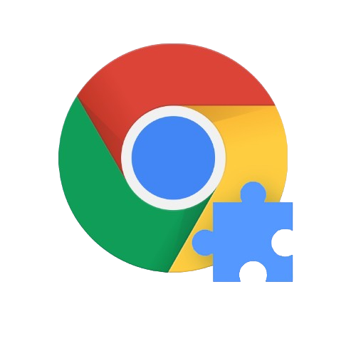

# Chrome Extension React Starter

## Introduction

A template with everything you need to develop your Chromium based browser
extension with all the features.

## What Does It Include?

- 🚀 React for a component-based UI
- 🎨 Tailwind CSS integration
- 📦 ShaCDN Integration
- 📁 Rollup (hot reload and release zip creation)
- 💻 Dockerized environment available
- 👨‍💻 Watch script to develop inside virtual machines

## Getting Started

This starter is prepared to handle 3 common development situations:

- Local development
- Development in a dockerized environment
- Development in a dockerized environment inside a virtual machine

> Any Node package manager can be used to execute the commands below.

### Local Development

Install the dependencies

`npm i`

Run the project

`npm run dev`

Create a production zip

`npm run release`

### Development In A Dockerized Environment

Run the project

`docker-compose -f docker-compose-dev.yaml up`

### Development In A Dockerized Environment Inside A Virtual Machine

Apart from running `docker-compose -f docker-compose-dev.yaml up` you will have
to run the `watch.sh` script located in the root folder to copy the output to a
shared folder with each change.

To do this, you must first install `inotifywait` with
`sudo apt install inotifywait` and then run `bash watch.sh` in another terminal.
